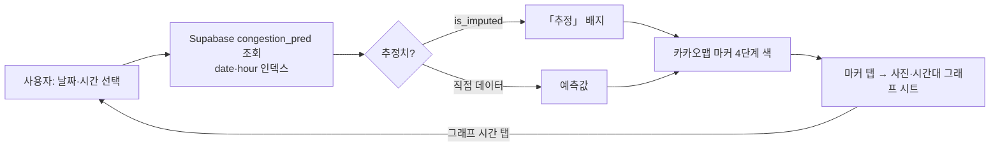
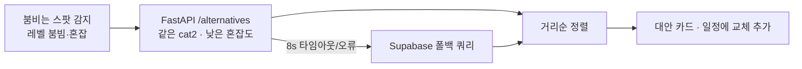
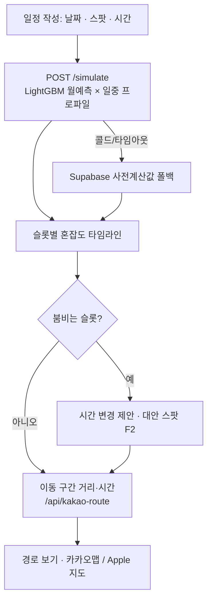
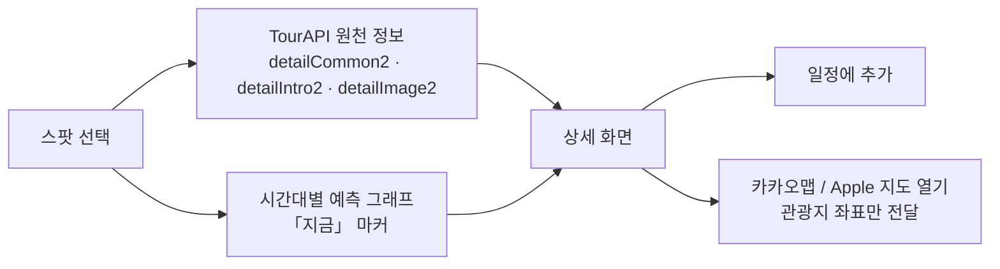

# 기능설명서 초안 · 제주나우 (양식 6개 섹션 1:1 매핑)

> 공식 양식(zip)에 옮겨 적기 위한 본문 초안. 양식 칸 크기에 맞춰 줄이거나 나눈다.
> 원칙: 예측값을 실측처럼 쓰지 않는다. 수치는 test hold-out 값만 쓴다(ml/artifacts/metrics.json).
> 출처 표기는 규정대로 `출처: ⓒ한국관광공사` 텍스트, 공사 로고 이미지 사용 금지.

---

## 1. 서비스 소개

### ① 서비스명
제주나우 (JEJU NOW)

### ② 서비스 유형
웹(PWA, https://jejunow.vercel.app) + 앱(iOS, App Store). 단일 코드베이스(Next.js + Capacitor)로 두 유형이 동일한 서비스.
> 앱 승인이 기한 내 안 나면 "웹"만 기재.

### ③ 서비스 개요
제주 관광지 804곳의 시간대별 혼잡도를 예측해 "지금 어디가 한적한가"를 보여주고, 가려던 곳이 붐비면 같은 유형의 한적한 대안 관광지를 추천하는 분산 관광 서비스. 한국관광공사 TourAPI로 관광지 정보를, 한국관광 데이터랩의 8년치(2018-01~2026-05) 인기관광지 수요 통계를 학습 데이터로 사용한다. LightGBM 모델이 스팟별 월 수요를 예측하고, 카테고리·요일·시간 방문 패턴과 결합해 9~20시 시간대별 4단계(여유·보통·붐빔·혼잡)로 표시한다. 지도, 일정 혼잡도 시뮬레이션, 자동 일정(오토플랜), 경로 안내(카카오맵·Apple 지도 연동)까지 이어지며 회원가입 없이 바로 사용한다.

### ④ 주제 선정 이유
- 제주 방문객은 연 약 1,400만 명이나 상위 10개 스팟에 수요가 집중된다. 특정 시간·장소 쏠림은 만족도 저하, 인프라 과부하, 탄소 배출로 이어진다.
- 기존 관광 앱은 인기·리뷰 기반 추천으로 쏠림을 오히려 강화한다. 여행자에게 필요한 정보는 "어디가 유명한가"가 아니라 "지금 어디가 한적한가"다.
- 제주특별자치도는 분산 관광을 정책 과제로 두고 있지만, 여행자가 현장에서 쓸 수 있는 수요 분산 도구는 없다. 한국관광공사가 이미 보유한 관광지 정보·수요 통계를 여행자의 의사결정에 연결하면 추가 인프라 없이 분산을 유도할 수 있다.

### ⑤ 서비스 핵심기능 (요약)
1. 시간대별 혼잡도 예측 지도: 날짜·시간 슬라이더로 804곳 마커 색이 바뀐다. "한적한 곳만" 필터, 추정치 표시.
2. 대안 관광지 추천: 붐비는 스팟과 같은 유형(TourAPI cat2)의 한적한 스팟을 가까운 순으로 제안.
3. 일정 혼잡도 시뮬레이션: 날짜·방문 순서를 넣으면 슬롯별 혼잡도와 이동 거리·시간을 타임라인으로 보여주고, 붐비는 슬롯에 대안·시간 변경을 제안.
4. 오토플랜(자동 일정): 취향 2지선다 → 도달 가능성·다양성·혼잡 회피를 만족하는 하루 일정을 자동 생성.
5. 관광지 상세·경로: 사진·개요·운영시간·홈페이지·시간대 그래프, 카카오맵·Apple 지도로 길찾기.

### ⑥ 서비스 대표 이미지 (1장)
후보: `store-assets/screenshots-6.5/1-dashboard.png` (홈, 제주나우 이름 반영본)

### ⑦ 서비스 상세 이미지 (3~5장)
후보: `2-map.png`(혼잡도 지도) · `3-schedule.png`(일정 시뮬레이션) · `4-detail.png`(상세) + 오토플랜 화면 1장(신규 캡처 필요) + 아이패드 `screenshots-ipad-13/1-dashboard.png`(반응형).
> 전부 최신 프로덕션에서 재캡처 권장: 재캡처 스크립트 `store-assets/ipad_screenshots.js`(시드·페이크클록 포함).

---

## 2. [선택] 지역 특화 서비스 구현 세부내용

### ① 특화 지역명
제주특별자치도 (제주시·서귀포시 전역)

### ② 구현 내용
- 대상 관광지: TourAPI `areaBasedList2`를 법정동 코드(lDongRegnCd=50, 제주) 기준으로 관광지(12)·문화시설(14)·레포츠(28) 유형 804곳 수집. 운영시간 722곳, 공식 홈페이지 579곳 보강.
- 학습 데이터: 한국관광 데이터랩 인기관광지 통계를 기초지자체(제주시 50110·서귀포시 50130) TOP30 × 연령대 6구간 × 101개월로 수집(36,360행). 제주 두 기초지자체만의 수요 구조를 학습.
- 기상 피처: 기상청 ASOS 제주 관측 월 기온·강수(101개월).
- 공항 앵커: 오토플랜은 제주국제공항 출·도착을 기본 앵커로 두고 동선을 구성(카카오 로컬 API 공항 전용 검색).
- 도로 접근점: 스팟 590곳에 도로 접근 좌표(route_lat/lng)를 별도 저장해 카카오 내비 경로가 산·해안 스팟에서도 실제 진입점으로 계산되게 함.
- 발전 방향은 전국 확대이므로 디자인·카피는 제주 상징(감귤·유채 등)에 묶지 않았다. 데이터와 앵커만 제주 특화.

---

## 3. 서비스 핵심 기능별 흐름도 (최대 5개)

### ① 기능명·설명 + ② 흐름도 (Mermaid 소스 → 이미지로 렌더해 양식에 삽입)

**F1. 시간대별 혼잡도 예측 지도**
사용자가 날짜·시간을 고르면 사전계산된 예측(congestion_pred, 45일 롤링)을 읽어 804곳 마커를 4단계 색으로 표시. 줌 9+에서는 격자 대표 마커로 솎아 렌더 부하를 줄이고, 화면에 보이는 마커만 부착.


**F2. 대안 관광지 추천**
붐비는 스팟(상위 30%)과 동일 cat2에서 혼잡도 낮은 스팟을 거리순으로 제안. FastAPI `/alternatives` 라이브 호출, 실패 시 Supabase 폴백.


**F3. 일정 혼잡도 시뮬레이션**
방문 순서·시간을 넣으면 슬롯별 예측을 라이브 추론(`/simulate`)해 타임라인으로 보여주고, 연속 스팟 간 이동 거리·시간을 카카오 내비(자동차)·도보 추정으로 표시.


**F4. 오토플랜(자동 일정)**
취향 2지선다 몇 번으로 하루 일정을 자동 생성. 공항 앵커 수렴, 도달 가능성 불변식, 유형 다양성, 혼잡 회피, 조건 완화 사다리를 코어 로직(lib/autoplan.ts)이 보장.
```mermaid
flowchart TD
  A[날짜 · 출발지(공항/현위치) · 이동수단] --> B[취향 2지선다 카드]
  B --> C[후보 스팟 점수화<br/>혼잡도 · 취향 · 거리 · 다양성]
  C --> D{도달 가능성 · 운영시간 충족?}
  D -- 아니오 --> E[완화 사다리: 반경↑ · 혼잡 허용↑]
  E --> C
  D -- 예 --> F[일정 생성 → 일정 탭 저장(기기 내)]
  F --> G[F3 시뮬레이션으로 검증]
```

**F5. 관광지 상세·경로 안내**
TourAPI 원천 정보(사진·개요·운영시간·전화·홈페이지)와 시간대 그래프, 지도 포커스, 카카오맵·Apple 지도 길찾기 버튼.


---

## 4. 데이터 활용 (한국관광공사 OpenAPI)

### ① 활용한 한국관광공사 OpenAPI 리스트

| OpenAPI | 세부기능 | 활용 내용 | 호출 위치·주기 |
|---|---|---|---|
| 국문 관광정보 서비스 KorService2 | `areaBasedList2` | 제주(lDongRegnCd=50) 관광지·문화시설·레포츠 804곳 명칭·좌표·분류(cat1~3)·대표 이미지·주소 | `api/collectors/collect_spots.py` · GitHub Actions 매주 수 00:10 KST |
| 〃 | `detailIntro2` | 운영시간(개장·폐장) → 일중 프로파일 경계, 상세 화면 운영시간 | 동일 수집기, 미확보 스팟 주간 보강 |
| 〃 | `detailCommon2` | 개요(overview)·전화·공식 홈페이지(예매 안내) | 동일 수집기(신규 스팟) + 백필 스크립트 |
| 〃 | `detailImage2` | 대표 이미지 없는 스팟의 첫 이미지 | 동일 수집기 |

- 인증키: 공공데이터포털 발급(인코딩·디코딩 키 제출). 일일 트래픽 1,000건 개발계정 → 쿼터 리셋 직후 배치 실행.
- 데이터 동기화 구조: TourAPI 응답을 Supabase `spots`에 주간 upsert하고, 앱은 `spots`를 읽는다(실시간 호출 아님). 사유: 예측 배치(804곳 × 45일 × 12시간 = 434,160행)가 스팟 목록과 결합돼야 하고, 일일 쿼터 1,000건으로는 사용자 요청마다 호출이 불가. 개발기간 내 호출 이력은 주간 배치로 계속 쌓임.
  > 대표님 결정(§제출준비 5-③)에 따라 "상세 화면 진입 시 detailCommon2 라이브 조회" 문장이 추가될 수 있음.
- 서비스 내 출처 표기: 설정 > 자주 묻는 질문 「데이터 출처」, 개인정보 처리방침 4항. 표기 문구 `출처: ⓒ한국관광공사`.

---

## 5. [선택] 데이터 활용 (기타)

| 구분 | 소스 | 용도 |
|---|---|---|
| 파일데이터 | 한국관광 데이터랩 인기관광지 통계(기초지자체 TOP30, 제주시·서귀포시, 2018-01~2026-05, 36,360행) | **예측 모델 학습 타겟**(스팟×월 인기 점유율 %). 데이터랩은 OpenAPI가 없어 로그인 CSV 내려받기로 수집 |
| OpenAPI | 기상청 지상(ASOS) 월 자료(공공데이터포털) | 월평균 기온·강수 피처 |
| SDK/API | 카카오맵 JavaScript SDK | 지도·마커·현위치 |
| API | 카카오모빌리티 길찾기 | 스팟 간 자동차 경로·시간(Vercel 함수 경유) |
| API | 카카오 로컬(키워드 장소 검색) | 오토플랜 공항·출발지 검색 |
| 딥링크 | 카카오맵 앱 · Apple 지도 | 길찾기 실행(관광지 좌표만 전달) |
| 라이브러리 | holidays(공휴일·연휴 피처) | 시간 피처 |

- 미반영: 제주 월 입도객 거시 피처(제안서 계획). 공공데이터포털 제공분은 연 1회 파일, 제주관광공사 빅데이터 플랫폼은 OpenAPI 미제공이라 월 단위 라이브 피처로 부적합. 발전 계획에 실측 연동과 함께 명시.

---

## 6. 서비스 차별성 & 발전계획

### ① 서비스 차별성

| 구분 | 기존 관광 추천 앱 | 제주나우 |
|---|---|---|
| 추천 기준 | 인기도·리뷰 | 예측 혼잡도(한적함) |
| 데이터 | 정적 콘텐츠 | 8년치 수요 시계열 학습 + 주간 갱신 예측 |
| 정책 효과 | 쏠림 심화 | 동일 유형 대안으로 수요 분산 |
| 커버리지 | 주요 스팟 | 제주 804곳(운영시간 722곳) |
| 시간 단위 | 일별 | 9~20시 시간대별 |
| 진입 장벽 | 회원가입 | 계정 없음, 위치 권한 없어도 전 기능 |

- 정직성: "혼잡도"는 실측 인원이 아닌 예측값(공개 통계 학습)임을 앱·스토어 설명에 명시. 원천 데이터 없는 703곳은 같은 유형 평균으로 대체하고 「추정」으로 표시. 모델 성능은 test hold-out(2026-01~05) 기준 MAE 0.46(점유율 %p) · MAPE 14.9% · 상위 30% 랭킹 일치 83.5%.
- 완성도: 웹·iOS 동일 코드베이스, 무중단 체계(UptimeRobot 핑 + GitHub Actions 3종 자동 갱신 + 라이브 추론 실패 시 사전계산 폴백), 앱 심사 대응 완료(Apple 지도 연동·권한 문구·아이콘).
- 개인정보: 계정·서버 저장 없음. 위치는 기기 안에서만 사용(위치기반서비스사업자 비신고 대상), 길찾기에는 관광지 좌표만 전달.

### ② 서비스 발전계획
- 단기(2026 하반기): 실측 데이터 연동 준비. 관광지 주차장·입장 카운트 등 실측 혼잡 지표를 확보해 예측→실측 캘리브레이션. 일중 프로파일(현재 카테고리·요일 휴리스틱)을 실측 곡선으로 교체.
- 중기(2027): 전국 확대. 코드·디자인이 지역 비의존이라 TourAPI 지역코드와 데이터랩 지자체 범위만 바꾸면 강원·부산·전주 등으로 확장. 지역 관광공사·렌터카·숙박 플랫폼과 연계해 분산 효과 정량화.
- 장기: 관광 수요 예측 API를 지자체·여행사에 B2B 제공, 지속가능 관광 지표 대시보드로 정책 활용. 소셜 로그인(v1.1 준비됨)으로 일정 동기화·개인화 추천.
